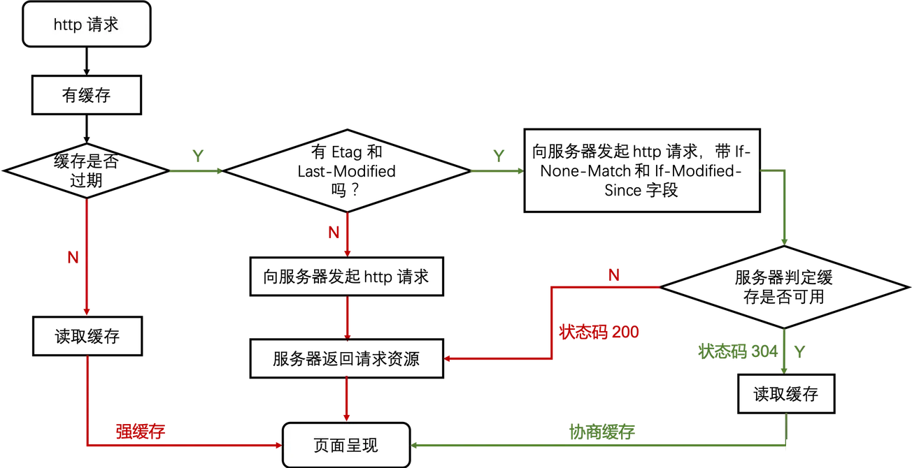

# 强缓存、协商缓存

**两者比较：**
* 优先使用 Etag。
* Last-Modified 只能精确到秒级。
* 如果资源被重复生成，而内容不变，则 Etag 更精确。

 

* 正常操作：地址栏输入 url，跳转链接，前进后退等。
* 手动刷新：f5，点击刷新按钮，右键菜单刷新。
* 强制刷新：ctrl + f5，shift+command+r。

 

**正常操作：强制缓存有效，协商缓存有效。手动刷新：强制缓存失效，协商缓存有效。强制刷新：强制缓存失效，协商缓存失效。**
