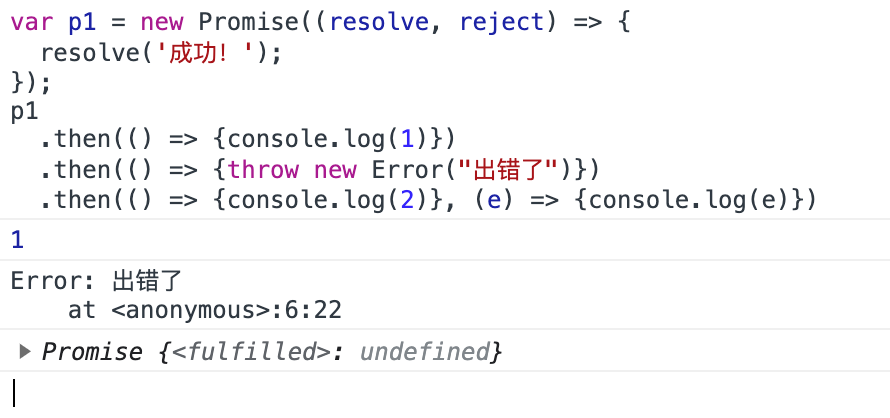
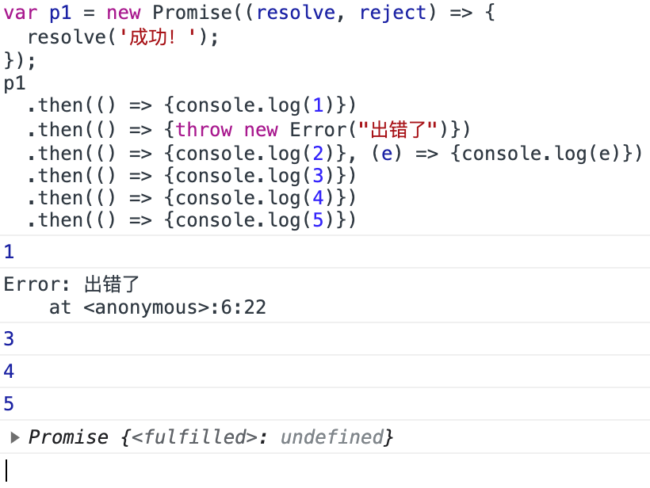
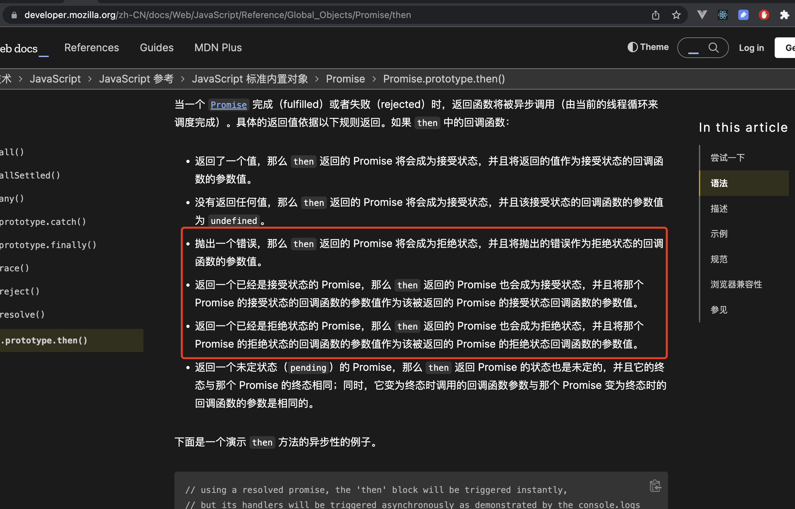
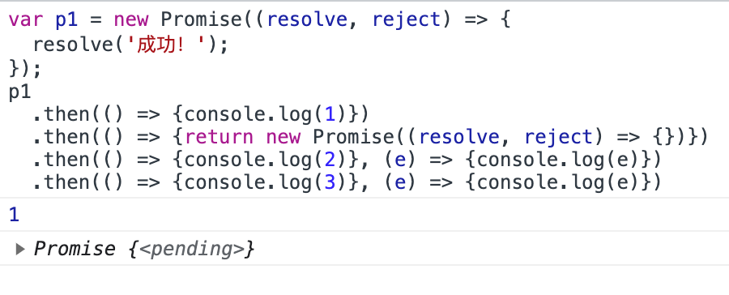

# promise.then

Promise 的成功和失败的回调函数

``` js 
var p1 = new Promise((resolve, reject) => {
  resolve('成功！');
});
```

来想象一下 p1.then().then().then().then() 中间某个的 then 出错了后面的then会执行吗？

以我们多年写代码的经验，如果后面有 catch 的话，那肯定不会执行。但是，如果没有 catch 后面还会不会执行呢？

``` js
p1
  .then(() => {console.log(1)})
  .then(() => {throw new Error("出错了")})
  .then(() => {console.log(2)}, (e) => {console.log(e)})
```

**执行结果：**



如图可知，后面的 then 是执行的，并且作为下一个 then 的参数传入。其实 then 的方法早在mdn上有解析。

那么问题又来了？第二个错了，第三个传入了第二参数，第四个还会执行吗？

**执行结果：**



如图可知，后面的 then 会执行，并返回 resolve 。翻查 mdn



既然 then 是回调函数总会返回和执行这就产生新的问题了？那怎样才能中断呢？

答案是：返回一个**不执行** resolve 或 reject 的 promise

``` js
p1
  .then(() => {console.log(1)})
  .then(() => {return new Promise((resolve, reject) => {})})
  .then(() => {console.log(2)}, (e) => {console.log(e)})
  .then(() => {console.log(3)}, (e) => {console.log(e)})
```




